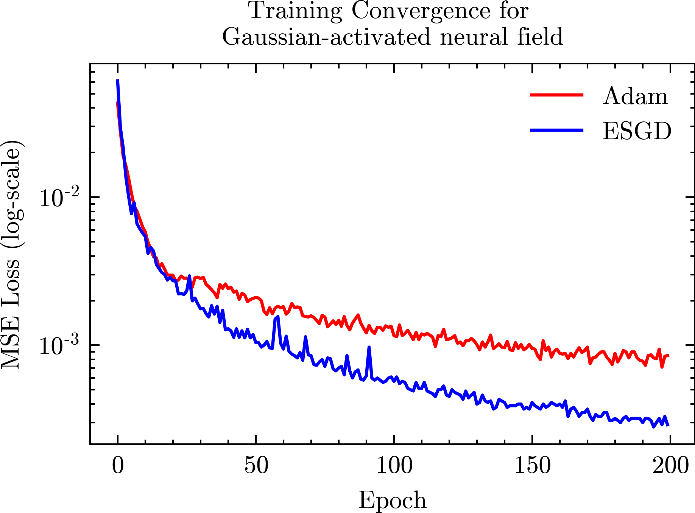
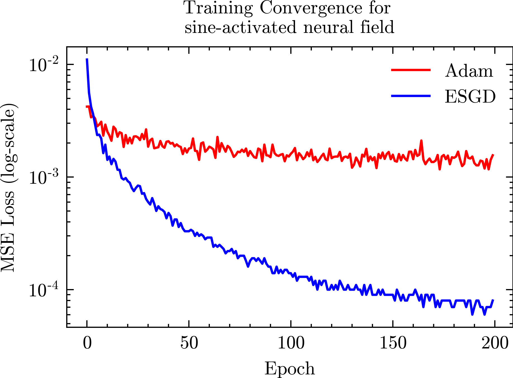
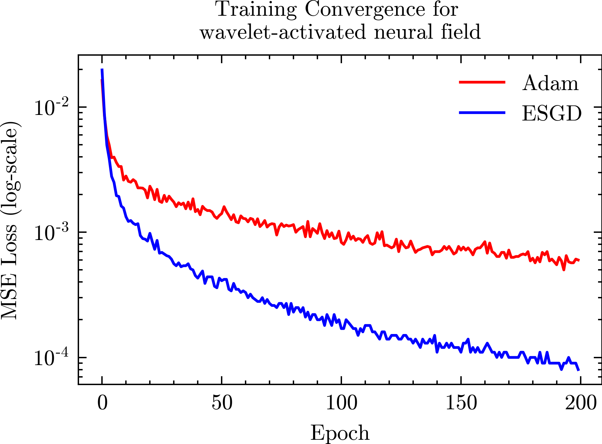
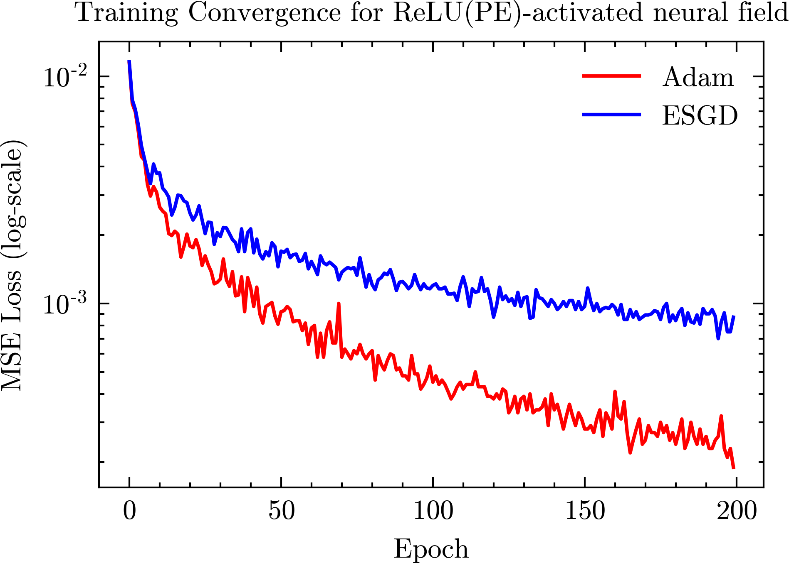

# Preconditioners for the Stochastic Training of Neural fields #
[Shin-Fang Chng](https://sfchng.github.io)\1,
[Hemanth Saratchandran]()\1,
[Simon Lucey]()1,
1Australian Institute for Machine Learning (AIML), University of Adelaide

This is the official implementation of the paper "Preconditioners for the Stochastic Training of Neural fields".

### Image experiments

  
  

