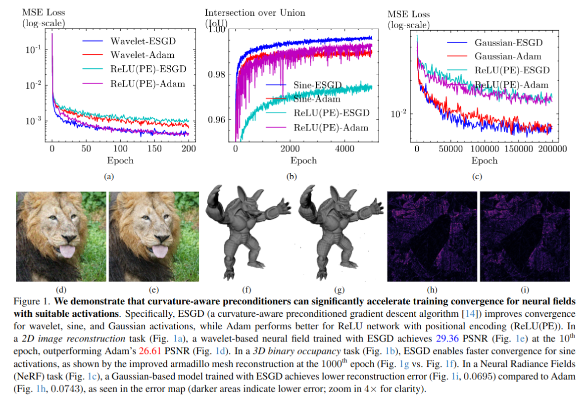

# Preconditioners for the Stochastic Training of Neural fields (CVPR-2025)
[Shin-Fang Chng](https://sfchng.github.io)\*,
[Hemanth Saratchandran]()\*,
[Simon Lucey]() <br>
Australian Institute for Machine Learning (AIML), University of Adelaide, \* denotes equal contribution


This is the official implementation of the paper "Preconditioners for the Stochastic Training of Neural fields".
<p align="center" width="100%">
 
</p>


## Getting Started ##

### Installation ###
```
## Clone the repo
git clone https://github.com/sfchng/preconditioner_neural_fields.git
cd preconditioner_neural_fields
```

### Setup Conda Environment ###
```
conda create -n precond_nf python=3.9 
conda activate precond_nf
pip install torch==1.12.1+cu113 torchvision==0.13.1+cu113 torchaudio==0.12.1 --extra-index-url https://download.pytorch.org/whl/cu113
pip install -r requirements.txt
python -m pip install libigl
```

## Data
### Div2k data ###
We use the ``div2k`` dataset for our 2d image experiment. Please download the dataset [here](https://universityofadelaide.box.com/s/13twlttg9aagf4srye11c6oh41t04dv5), and place it under
the directory ``data/images``.

### Stanford data ##
We use the ``stanford`` dataset for our 3d binary occupancy experiment. Please download the dataset [here](https://universityofadelaide.box.com/s/k435ov4uoj8pybzdunuc3m92gap14zjp), and place it under the directory ``data/bocc``.

## Running this repo ##
```
# Image experiment
./scripts/neural_image.sh
```

```
# Binary occupancy experiment
./scripts/neural_bocc.sh
```

### Key results ###
ESGD (a Curvature-aware preconditioned gradient descent algorithm) improves convergence for Gaussian, sine and wavelet activations, while Adam performs
better for ReLU network with positional encoding (ReLU(PE)). We provide training convergence for a 2D image reconstruction task as an example below
<p align="center" width="100%">
  
  
</p>


<h2 id="citation"> 📖 Citation  </h2>

```
@article{chng2024preconditioners,
  title={Preconditioners for the stochastic training of implicit neural representations},
  author={Chng, Shin-Fang and Saratchandran, Hemanth and Lucey, Simon},
  journal={arXiv preprint arXiv:2402.08784},
  year={2024}
}
